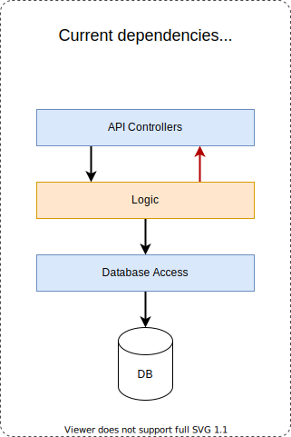
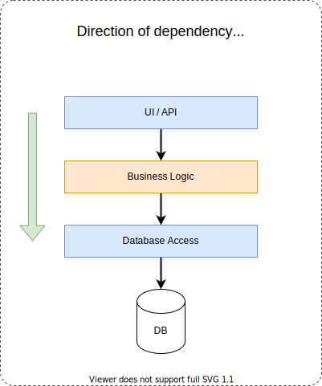
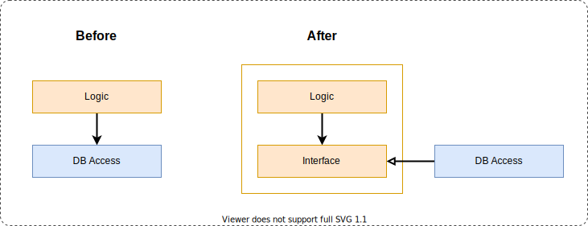
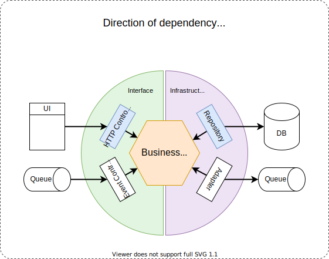
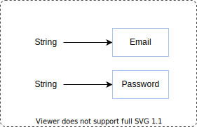

# Understanding Direction of dependency

A crucial part of most architectures is restricting allowed dependencies between parts of your codebase. The exercises
below will help you to understand the relevance of directions of dependency within your code.

How do you recognize dependencies in code? In typical OO languages, a piece of code depends on another piece of code
when it has an import for it.

Apart from recognizing dependencies, it is equally important that you know how to control them.

## The code

What you are looking at is a minimal application that allows registering new users.

The application exposes a REST API and stores the registrations in a database.

As we're just practising here, it uses an in-memory database.

Take a look at the tests and the code and make sure you roughly understand what is going on.

---
---
---

## Exercise 1

The UserService contains the business logic of the application.

As you'll notice, it has imports to both the persistence and routes packages. That makes the service hard to unit test
on its own. In a typical layered architecture like this, dependencies are only allowed in one direction: downward.

Practice inverting the direction of dependency by finding a way to **make the UserService no longer import anything from
the api package**.

---
---
---

## Exercise 2

To make you business logic even easier to test, you can use hexagonal (or onion) architecture to ensure that your
business logic does not depend on anything at all.

Hint: to achieve this, you may need to introduce an interface.

Practice inverting the direction of dependency by finding a way to **make the UserService no longer depend on the
persistence package**.

---
---
---

## Exercise 3

Currently, email and password are both represented as strings.

Practice introducing [**Value objects**](https://medium.com/swlh/value-objects-to-the-rescue-28c563ad97c6) by replacing
each of these with a simple `data class` that wraps the raw value.

