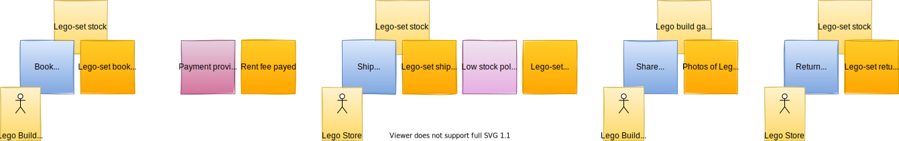
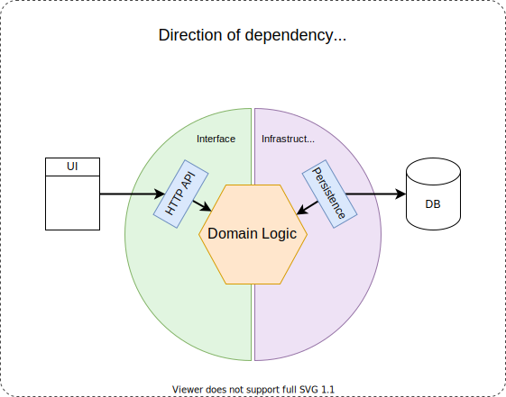
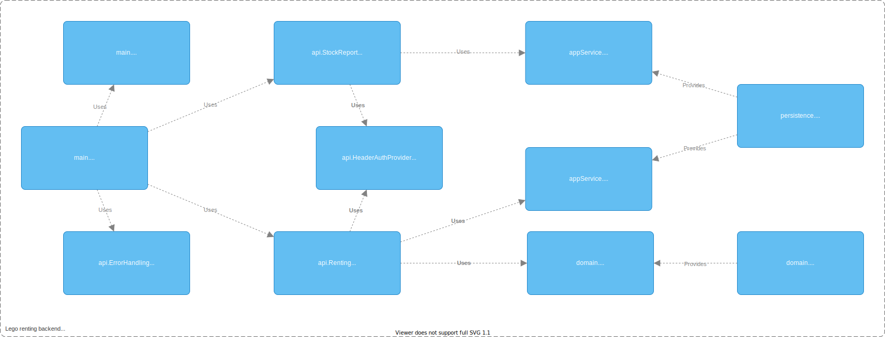

# Take small steps

When you make changes in your codebase, you want to do so in small steps. Research shows that reducing batch size has
many benefits:

- End-users benefit sooner
- You get feedback sooner
- Lower risk of deploys
- Lower risk of building the wrong thing
- Easier to keep everybody working on the latest version of the code

And if you are doing code reviews instead of pair-programming, then you'll agree that it's much nicer and easier to
review a small PR compared to reviewing big PRs.

That all sounds nice in practice, but how do you do that when you are changing something that will impact many
places throughout your codebase? That is a tough problem and the common solution is to just do all the work in an
isolated branch and hope nothing breaks when it gets merged... we all know how that typically ends.

So instead of going for the easy route, let's find ways to make big changes in small steps while keeping everything
working, deployable and integrated with all the other work that is being done.

To make that concrete, the following exercises let you experience first-hand how you **can** take small steps.

## Understand the domain

The domain used for this assignment is that of renting lego. To get an idea of how this works in real-live,
look at sites like: [www.bricksverhuur.nl](https://www.bricksverhuur.nl)
or [bouwsteenwinkel.nl](https://bouwsteenwinkel.nl/)

Whenever you encounter a new codebase, the best place to start understanding what it is about is by trying to understand
the domain that it is used in. A useful technique that is closely related to Domain-Driven Design
is [Event Storming](https://en.wikipedia.org/wiki/Event_storming).

Event Storming is a lightweight workshop-based method to quickly find out what is happening in the domain of a software
program. You bring together domain experts and software developers in a room without chairs and with an 'infinite
modeling surface', typically a band of brown-paper stuck to a large wall and an infinite amount of sticky notes.

Next, start by putting domain events "things that happen" onto a timeline. Then bit-by-bit you introduce more detail by
adding commands, user, aggregate, view and more.

The key is involving the right mix of people, so you can ask the right questions and find answers and understand the
many things happening in a business.

Below is the result of an Event Storming session that focused on the domain of renting lego sets.

## Understand the code

As we want to make big changes, the following codebase is slightly bigger than the one from part 1.
That also means it will take a bit more time for you to familiarize yourself with this codebase.

The application uses an architecture resembling the hexagonal / onion architecture you encountered in part 01. The key
ingredient is that all dependencies point inward to the domain services and domain model.

The following [C4 Component-level diagram](https://c4model.com/#ComponentDiagram) provides a conceptual map of the
components in the system, their responsibilities and their technology details. _For clarity, this is not a class
diagram, although you will typically find a class corresponding to each of these components, not all classes in the
system are part of this diagram. That would become a bit too cluttered and would make it harder te see the important
parts._

Go and `take a look at the code` and see if you understand what is going on. Also `take a look at the tests`. Tests often
reveal more about what a system is supposed to do than the production code itself.

- Run all tests by pressing `Crtl + Alt + R`, selecting `Tests in 'part-02` and pressing `enter`.

## Exercises

Now that you have a basic understanding of this codebase, let's do a few exercises that take us through techniques that
will help you make big changes in small steps.

- [Encapsulation](01_Encapsulation.md)
- [Vertical Slice architecture](02_VerticalSlice.md)
- [Feature toggles](03_FeatureToggles.md)
